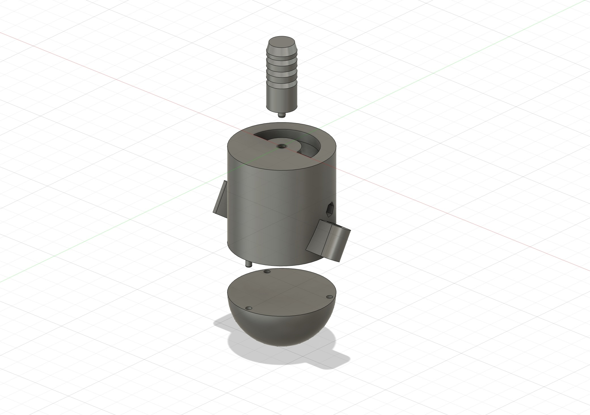
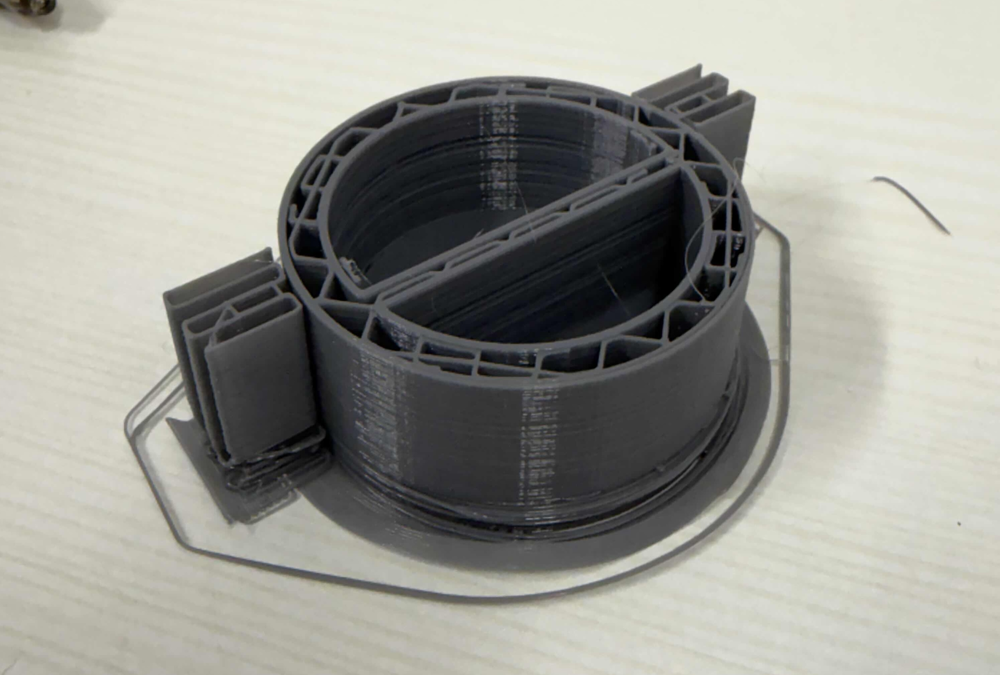
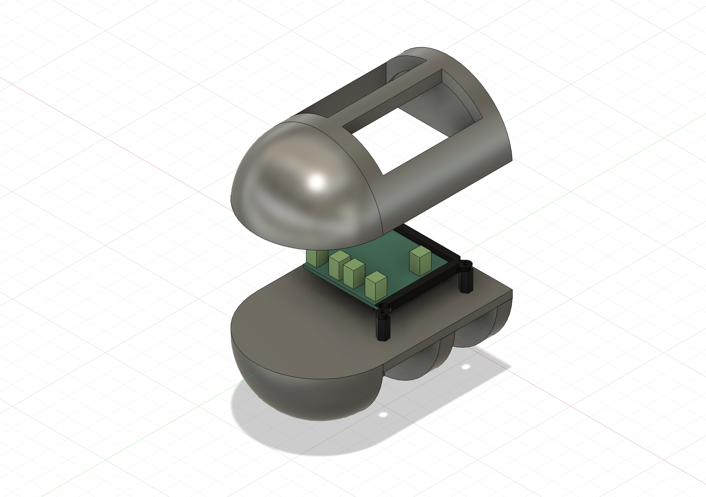
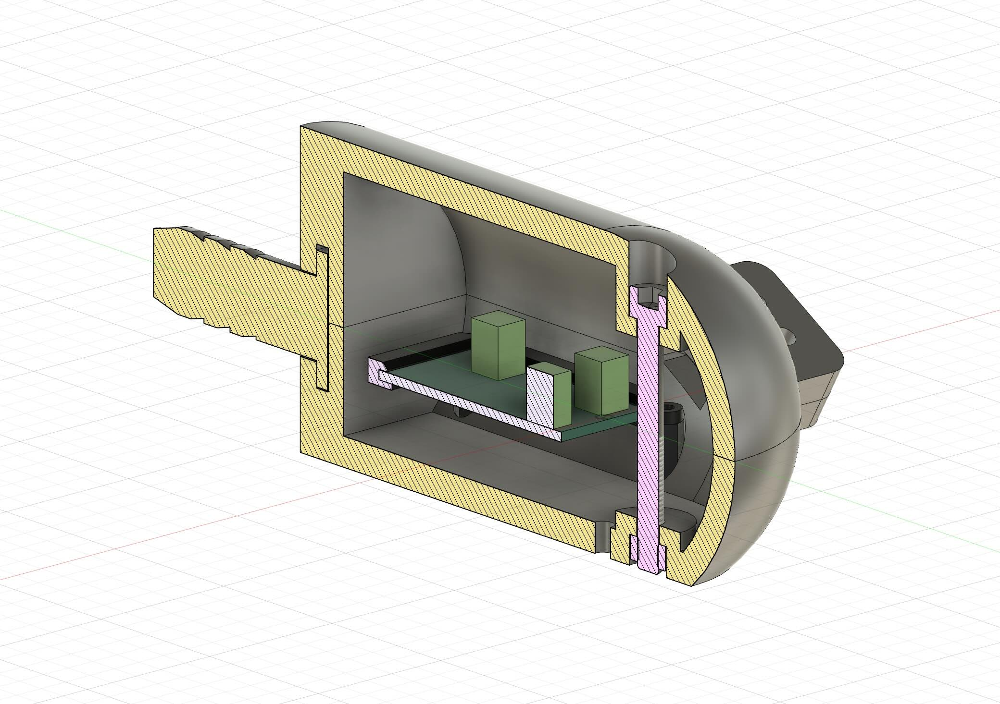
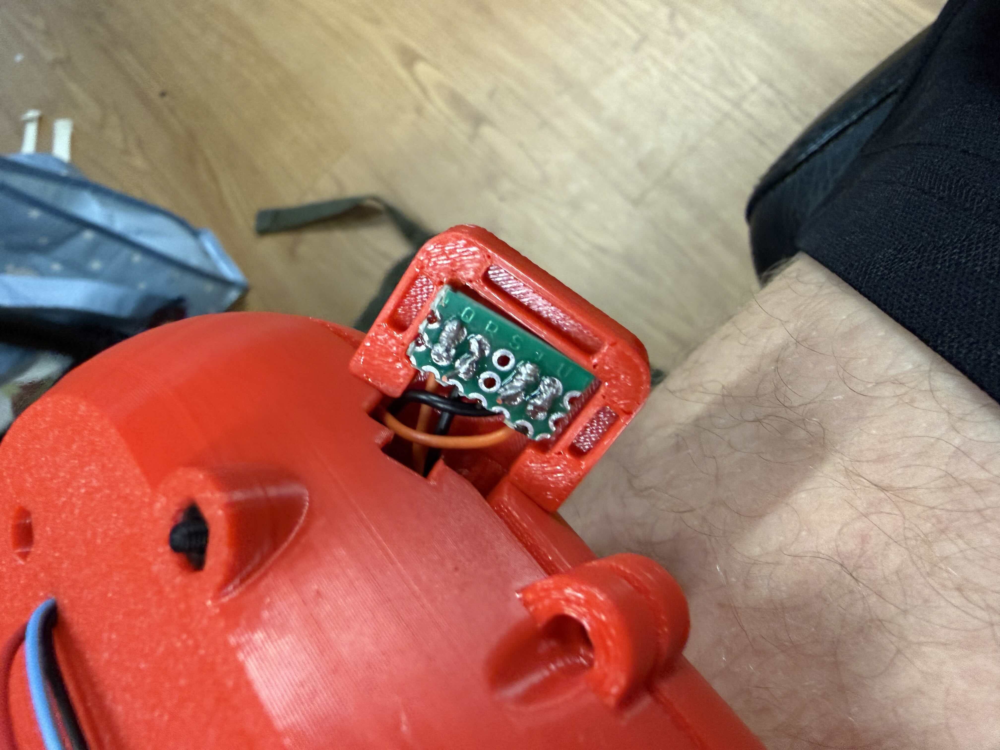

## O projektu
V rámci finálního týmového projektu na výměnném pobytu na Singapore University of Technology and Design, jsem měl zá úkol navrhnou kryt pro IR senzory naší chytré slepecké hole.

První iterace měla mnoho problémů. Od kolegů jsem neměl rozměry elektronických součástek, které do krytu měly patřit, takže jsem tipoval rozměry.

Návrh se skládal z kolíku, který tvořil uložení s přesahem s holí. Ten se čepem nalisoval do hlavního těla dutého válcového krytu, který měl po stranách dva výstupky pro samotné IR senzory. Na tělo se čepy nalisovala tzv. čepice půlkulového tvaru.

Hlavní problém byl v čepech. Bylo težké nadimenzovat čepy a otvory, aby do sebe pasovaly a zároveň držely. Zároveň byly čepy tak malé, že měli tendenci prasknout při menším zatížením. Materiál prvních tisků byl PLA.

Druhý návrh chtěl vyřesit problém smontovatelnosti. Do prvního návrhu bylo težké vměstnat elektroniky, jelikož byl relativně uzavřený. Proto jsem u druhého návrhu ustoupil od "čepicového" designu, a rozhodl jsem návrh těla uskutečnit rozpůleným válcovým tvarem.

Tento návrh se nedostal daleko, jelikož nevyužíval efektivně prostor a otevřená elektronika by nepůsobila dobře. Byl rychle vyměněn dalším návrhem.

Ten je druhému podobný, ale elektronika byla vložena takovým způsobem, který zaručoval minimální průměr válce. Nový návrh nevyužíval žádné čepy a místo toho byla většina spojů řešena pomocí vložených matic. U těch jsem došel k optimální vůli 0.2mm.

Zároveň byl u prvního návrhu problém s tiskem výstupků pro IR senzory. Jelikož se tiskl pod úhlem a na podpěrách, tak nevypadal dobře a výsledek byl velmi nepřesný. Proto jsem se u třetího návrhu rozhodl tisknout výstupky zvlášť a připevnit je pomocí rybinového spoje k hlavnímu tělu. Jelikož se rybinový spoj musel tisknout na těle pod úhlem, nebyl velmi přesný a nakonec jsme využili vteřinového lepidla, aby věci lépe drželi.

Vetšina šroubů byla zvolena na základě toho co mi bylo dostupné. Většina byla M2.5 plus jeden M5x40 inbusový šroub, který jsem našel ve šrotu.

Celkově finální design vyřešil problém rozbíratelnosti a držel v rámci možností docela dobře.

